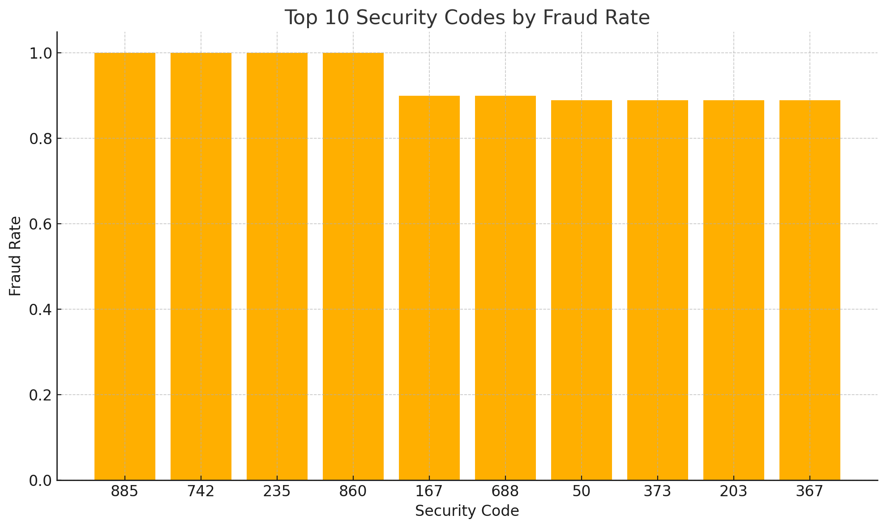

## 📊 Fraud Detection SQL Analysis (BigQuery Only)

### 🔍 Project Overview
This project is a comprehensive SQL-only data analysis case study focused on fraud detection. The entire data wrangling, enrichment, and insight generation process was performed in **Google BigQuery**, with no use of Python or external tools.

The main goal was to demonstrate **advanced SQL skills** across all stages of data analysis, from preprocessing and feature engineering to fraud pattern analysis and business insights.

---

### 🗂 Dataset
The dataset consists of 10,000 transactions with the following columns:
- `Profession`: Customer's profession  
- `Income`: Annual income  
- `Credit_card_number`: Credit card number  
- `Expiry`: Expiry date in MM/YY format  
- `Security_code`: Security code (CVV)  
- `Fraud`: Binary fraud flag (1 for fraud)  

---

### 🧹 Data Cleaning & Preparation
All data preparation was done using SQL in BigQuery:
- Splitting `Expiry` into `expiry_month` and `expiry_year`
- Extracting `card_length` (length of credit card number)
- Creating `income_category` (Low / Medium / High) based on income thresholds
- Checking for NULL values and duplicates

Created cleaned dataset: `cleaned_data`

---

### 📈 Analysis & Insights

#### 🔹 Fraud Rates by Category
- Overall fraud rate: **~50.16%**
- Profession with highest fraud rate: **Doctors (52.06%)**
- High-income users have slightly higher fraud exposure

#### 🔹 Feature Engineering Results
- `card_length` and `security_code` showed strong correlations with fraud
- Short card lengths (11–13 digits) had noticeably higher fraud rates

#### 🔹 Advanced Aggregations
- Fraud rates per `Profession × Income Category`
- `card_length` breakdown by profession
- Risk ranking per profession based on fraud_rate

---

### ⚠️ Fraud Detection Logic
Introduced a new logic-based field: `fraud_alert_level` with values like:
- `Critical Fraud Case`
- `Recent Card Fraud`
- `Unusual Card Structure`
- `Likely Exploited Pattern`
- `Generic Fraud`
- `Clean Transaction`

---

### 🔺 Fraud Prioritization Matrix
Each `fraud_alert_level` was assigned a business priority level (Immediate / High / Moderate / Low) based on fraud share and average income impact.

| Alert Level               | Priority | Avg Income | Fraud Share |
|--------------------------|----------|------------|-------------|
| Critical Fraud Case      | Immediate| €80,956.27 | 3.2%        |
| Recent Card Fraud        | High     | €50,161.76 | 8.0%        |
| Generic Fraud            | Moderate | €49,948.06 | 83.5%       |
| Unusual Card Structure   | Moderate | €29,714.64 | 5.0%        |
| Clean Transaction        | Low      | €49,548.18 | 0.0%        |

---

### 🏆 Leaderboard – Top 10 Security Codes by Fraud Rate

| Security Code | Fraud Rate |
|---------------|------------|
| 885           | 100%       |
| 742           | 100%       |
| 235           | 100%       |
| 860           | 100%       |
| 167           | 90%        |
| 688           | 90%        |
| 50            | 88.89%     |
| 373           | 88.89%     |
| 203           | 88.89%     |
| 367           | 88.89%     |

---

### 📊 Visualization Sample

---

### 🛠️ Tools Used
- **Google BigQuery (Free Tier)** – All queries and logic
- **Matplotlib (local)** – One chart created based on exported query results

---

### 🧠 Skills Demonstrated
- Advanced SQL (CASE, CTEs, Window Functions, Conditional Aggregation)
- Feature Engineering with SQL only
- Fraud Detection Logic Design
- Data Cleansing, Enrichment & Categorization
- Pivoting and Risk Prioritization

---

### 👤 Author
Christos Papakostas
